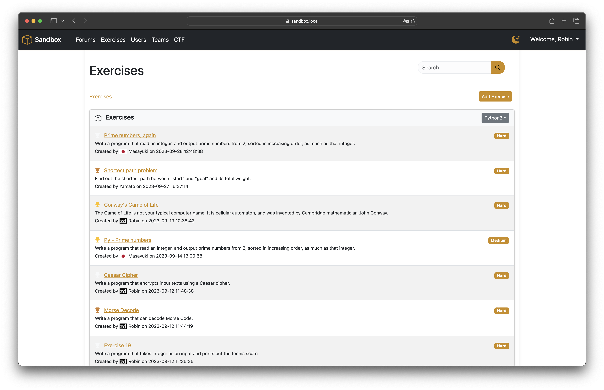

# sandbox
Sandbox Application




## Installation

```bash
$ git clone https://github.com/zerodayz/sandbox.git
$ cd sandbox
$ pip install -r requirements.txt
``` 

## Development

### Running the sandbox application locally

```bash
$ python3 app.py
```

## Production
### Requirements
- nginx
- podman (for running the sandbox containers)

```bash
$ sudo apt-get install nginx
$ sudo apt-get install podman
```

### Running the sandbox application in Production

Execute any pending DB migrations
```bash
$ flask db upgrade
```

Pre-fetch the docker images for the sandbox containers
```bash
$ podman pull docker.io/library/python:3.11
$ podman pull docker.io/library/golang:1.21
```

There is a script that will run the sandbox application in gunicorn and nginx.
```bash
$ ./run.sh
```

### Update the sandbox application in Production

```bash
$ git pull
$ flask db upgrade
$ ./stop.sh && ./run.sh
```
